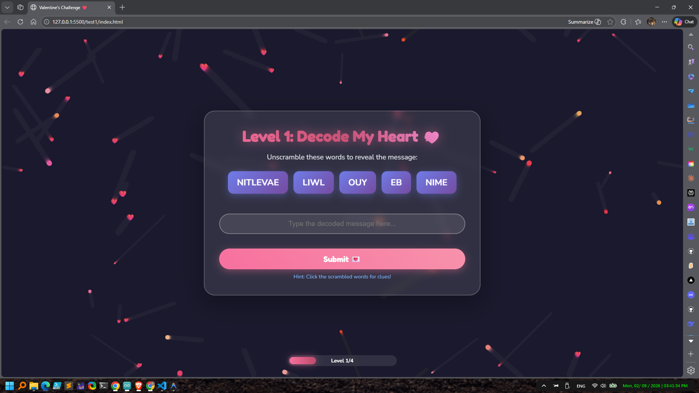

# 💕 Valentine's Challenge - Interactive Love Game

A romantic, interactive web-based game designed to unlock hearts through four engaging levels of puzzles and challenges!

## Features ✨

- **Level 1: Decode My Heart** - Unscramble words to reveal a heartfelt message
- **Level 2: Navigate My Heart** - Guide a heart through an exciting maze
- **Level 3: Match Our Memories** - Test your memory with a matching game
- **Level 4: The Final Choice** - The ultimate romantic decision awaits!

## Highlights 🎯

✅ Beautiful animated background with floating hearts and particles  
✅ Smooth transitions between levels with progress tracking  
✅ Interactive elements with rotating animations  
✅ Victory screen with fireworks celebration  
✅ Sound effects for immersive experience  
✅ Fully responsive design for all devices  

## How to Play 🎮

1. Open `index.html` in your browser
2. Complete each level by following the on-screen instructions
3. Advance through all 4 levels to reach the finale
4. Make your choice and celebrate! 🎉

## Tech Stack 🛠️

- **HTML5** - Canvas animations for dynamic backgrounds
- **CSS3** - Glassmorphism effects, gradients & animations
- **JavaScript** - Game logic, maze solving, memory matching

Perfect for Valentine's Day proposals, anniversaries, or just spreading the love! 💘

